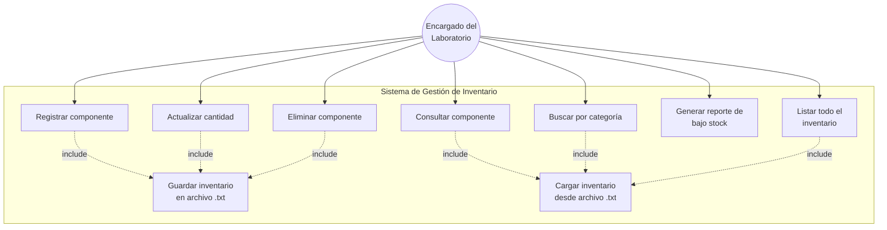
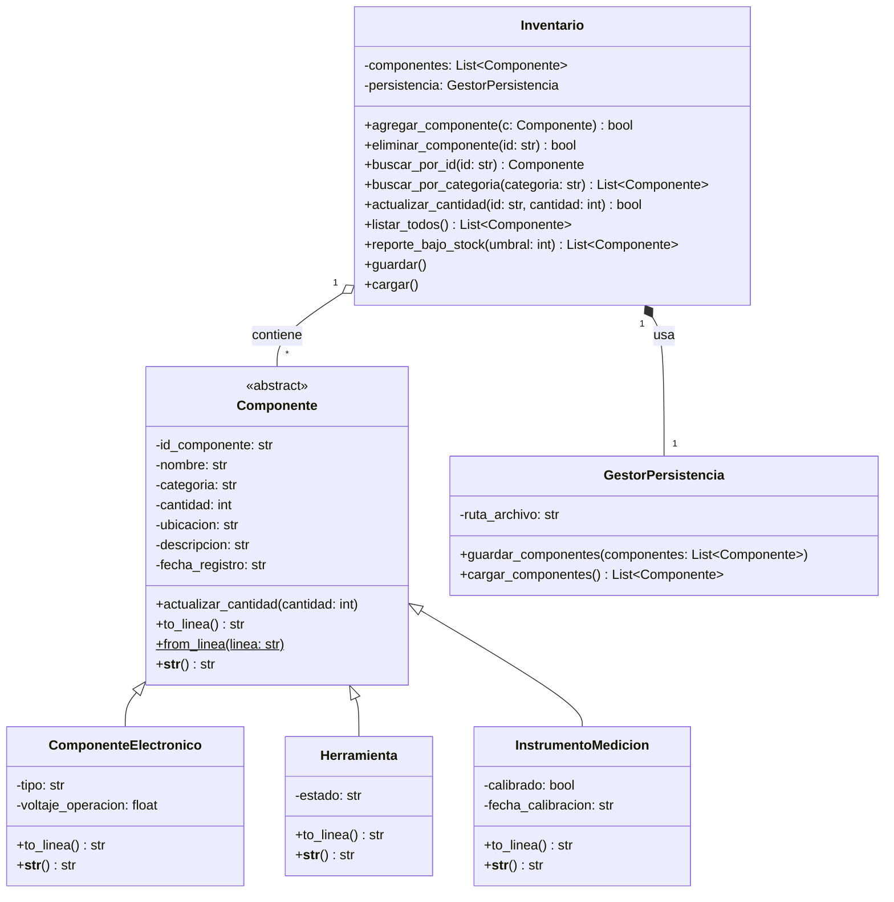
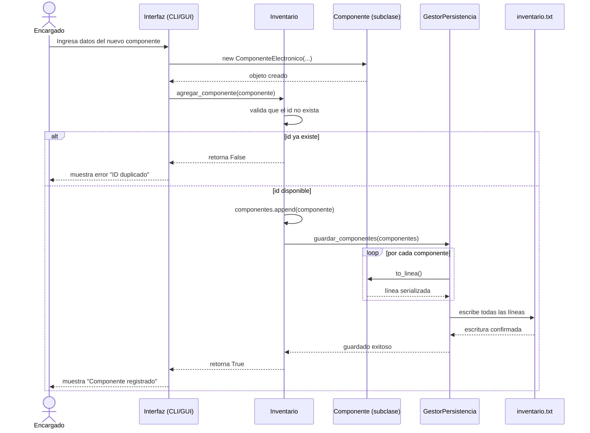
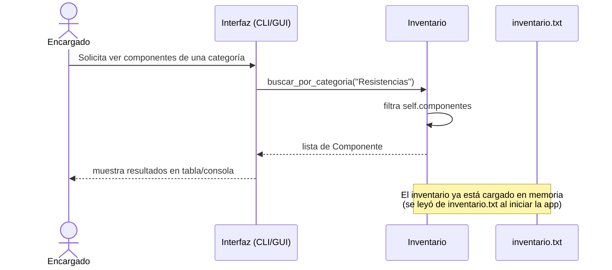

# Diagramas UML — Sistema de Gestión de Inventario de Laboratorio de Electrónica

Los diagramas están en sintaxis **Mermaid**. Se pueden visualizar en GitHub, VS Code (extensión Mermaid), o en https://mermaid.live/

---

## 1. Diagrama de Casos de Uso

**Descripción de actores:** el único actor es el *Encargado del Laboratorio*, responsable de mantener actualizado el inventario de componentes electrónicos, herramientas e instrumentos de medición.

---

## 2. Diagrama de Clases

**Notas de diseño:**
- `Componente` es la clase base (herencia) que define atributos y comportamiento comunes.
- Las subclases (`ComponenteElectronico`, `Herramienta`, `InstrumentoMedicion`) demuestran **polimorfismo**: cada una serializa (`to_linea`) y se representa (`__str__`) de forma distinta.
- `Inventario` usa **composición** con `GestorPersistencia` para delegar la lectura/escritura del archivo `.txt`, separando responsabilidades (principio de responsabilidad única).

---

## 3. Diagrama de Secuencia — Registrar un nuevo componente

---

## 4. Diagrama de Secuencia — Consultar / Buscar por categoría

